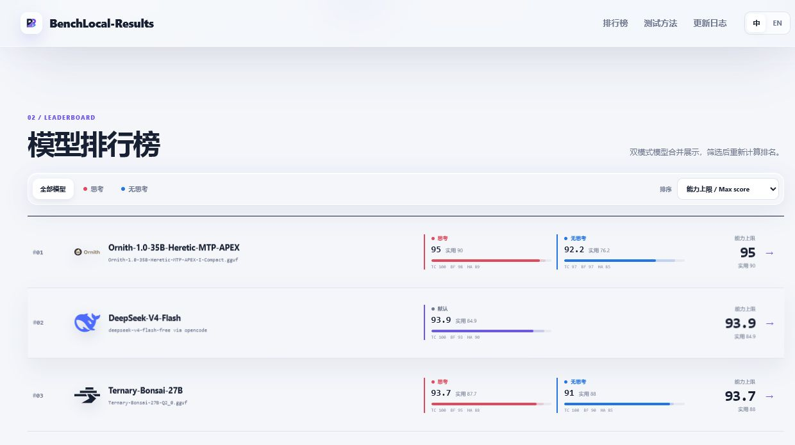
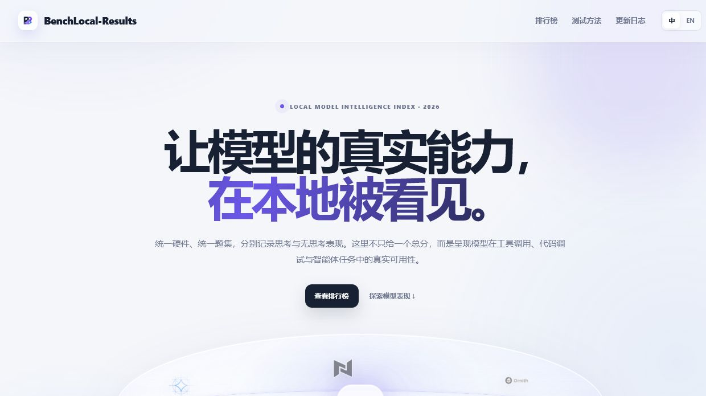
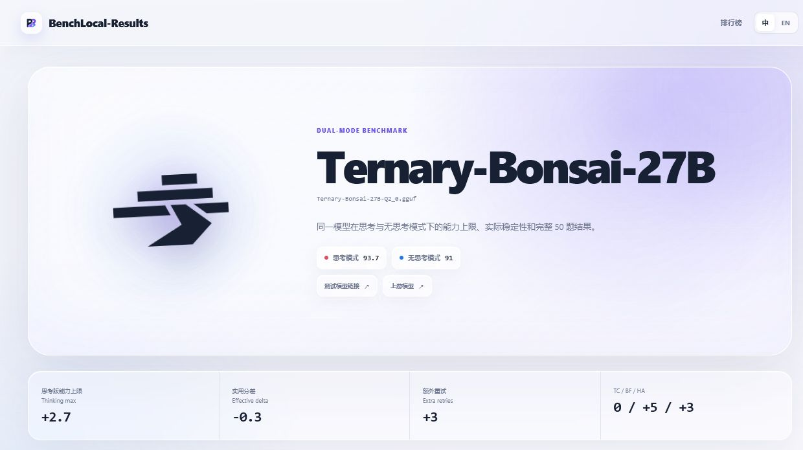

<div align="center">
  <h1>BenchLocal-Results 本地模型评测数据库</h1>
  <p>基于 <a href="https://github.com/stevibe/BenchLocal">BenchLocal</a> 的本地模型基准测试成绩展示</p>
  <p><a href="https://scorp1o117.github.io/benchlocal-results/">🌐 在线查看</a></p>
</div>

---



## ✨ V1.0

V1.0 将项目从手工维护的成绩页面升级为由评测快照驱动的静态站点：

- **统一数据源**：从 BenchLocal `runs/` 提取三套题集结果，生成可追溯的规范化快照。
- **双评分口径**：同时展示能力上限与扣除成功题额外重试后的实用得分。
- **模式合并**：同一模型的思考与无思考配置共享一张排行榜卡片和一个详情页。
- **完整明细**：详情页保留 ToolCall、BugFind、HermesAgent 共 50 题的最终结果与重试信息。
- **自动构建**：从快照生成目录数据、首页、详情页、模式对比和旧地址兼容跳转。
- **发布门禁**：校验评分、运行来源、页面一致性、本地资源、链接安全与脚本语法。
- **本地化资源**：运行时不依赖远程字体或图片，模型 LOGO 和方法插图随站点发布。

## 📊 测试概览

基于 BenchLocal 桌面应用，在统一硬件与题集下记录 15 个模型、23 个配置的本地推理表现。思考与无思考结果按模型合并展示，同时保留能力上限和计入重试成本的实用得分。

| 测试项目 | 题数 | 说明 |
|----------|------|------|
| [ToolCall-15](https://github.com/stevibe/ToolCall-15) | 15 | 工具调用测试，覆盖参数提取、多轮上下文、并行调用等 |
| [BugFind-15](https://github.com/stevibe/BugFind-15) | 15 | 跨语言代码调试，含 Trap 陷阱题，难度 Easy~Expert |
| [HermesAgent-20](https://github.com/stevibe/HermesAgent-20) | 20 | Agent 场景测试，覆盖记忆管理、技能创建、调度投递等 |

**加权总分** = ToolCall×0.3 + BugFind×0.3 + HermesAgent×0.4

**评分口径**：能力上限为三项测试的加权分；实用得分 = 能力上限 − 成功题重试次数。首次通过不扣分，重试后通过每额外尝试一次扣 1 分。

## 🏆 模型排行榜

排行榜按每个模型的最高能力上限排序；完整双模式数据和实用得分请在网站中筛选查看。

| # | 模型 | 代表模式 | 能力上限 | 实用得分 | ToolCall | BugFind | HermesAgent |
|---|------|----------|---------:|---------:|---------:|--------:|------------:|
| 1 | Ornith-1.0-35B-Heretic-MTP-APEX | 思考 | **95.0** | 90.0 | 100 | 98 | 89 |
| 2 | DeepSeek-V4-Flash | 默认 / API | 93.9 | 84.9 | 100 | 93 | 90 |
| 3 | Ternary-Bonsai-27B | 思考 | 93.7 | 87.7 | 100 | 95 | 88 |
| 4 | Ornith-1.0-35B-MTP-APEX | 思考 | 93.5 | 75.5 | 100 | 93 | 89 |
| 5 | Agents-A1 | 无思考 | 93.1 | 61.1 | 97 | 100 | 85 |
| 6 | Qwen3.6-27B | 思考 | 91.9 | 73.9 | 100 | 93 | 85 |
| 7 | Gemma-4-26B-A4B-it-qat | 思考 | 91.8 | 83.8 | 93 | 97 | 87 |
| 8 | Qwen3.6-35B-A3B-uncensored-MTP | 无思考 | 91.5 | 80.5 | 97 | 96 | 84 |
| 9 | Gemma-4-12B-it-heretic-QAT | 思考 | 90.3 | 85.3 | 97 | 88 | 87 |
| 10 | Ornith-1.0-9B-heretic-MTP | 思考 | 89.8 | 68.8 | 100 | 94 | 79 |
| 11 | Step-3.7-Flash-APEX-I-Mini | 思考 | 88.5 | 78.5 | 100 | 87 | 81 |
| 12 | Qwen-AgentWorld-35B-A3B-APEX-I-Compact | 思考 | 88.5 | 87.5 | 100 | 87 | 81 |
| 13 | QwenPaw-Flash-9B | 思考 | 88.4 | 64.4 | 100 | 88 | 80 |
| 14 | Nex-N2-Mini | 思考 | 86.7 | 59.7 | 93 | 88 | 81 |
| 15 | Qwen-AgentWorld-35B-A3B-MTP-Uncensored | 思考 | 85.6 | 81.6 | 93 | 87 | 79 |

## 🖥️ 界面预览





## 🔄 数据到网站

一轮 ToolCall → BugFind → HermesAgent 测试完成后，在 `site/` 目录执行：

```powershell
npm run status
npm run extract -- --latest --variant thinking
npm run build
npm run check
```

`--variant` 可使用 `thinking` 或 `no-thinking`。提取器会确认三套结果属于同一模型并按正确顺序完成，随后生成快照、归档原始 summary，并由构建器更新合并排行榜和详情页。完整操作与显式 run 路径示例见 [发布工具说明](publisher/README.md)。

> 评测结果来自固定本地硬件与当前题集，适合观察本项目内的相对表现，不代表跨硬件、跨后端或其他任务上的普遍排名。速度数据仅用于记录测试环境。

## 🔧 测试环境

- **硬件**：RTX 5070 Ti 16GB + 128GB RAM，MoE模型部分专家层offload到CPU
- **推理后端**：llama.cpp
- **模型下载**：[HF: SC117](https://huggingface.co/SC117)

## 📁 文件结构

```
├── index.html              # 首页（排行榜 + 排序筛选）
├── models/                 # 模型详情页（同模型的思考/无思考模式合并）
├── icons/                  # 模型图标（@lobehub/icons）
├── publisher/              # 数据提取、归档和发布前校验
├── RUNBOOK.md              # 测试、构建、预览和发布标准流程
└── screenshots/            # README 截图
```

## 🚀 本地开发

```bash
git clone https://github.com/Scorp1o117/benchlocal-results.git
cd benchlocal-results
# 用任意 HTTP 服务器打开
python -m http.server 8000
```

## 🧰 数据发布流程

`publisher/` 提供一套无第三方依赖的发布工具，用于：

- 从 ToolCall、BugFind、HermesAgent 三份 `summary.json` 提取顶层最终成绩；
- 统一计算成功题重试次数、能力上限和实用得分；
- 将原始结果按模型自动归档并进行 SHA-256 校验；
- 将同一模型的思考/无思考成绩合并为一张首页卡片和一个详情页；
- 检查规范化数据、HTML 内联脚本、本地链接、模型卡片及详情页完整性。

日常操作见 [RUNBOOK.md](RUNBOOK.md)，完整工具参数见 [publisher/README.md](publisher/README.md)。发布前运行：

```bash
npm run check
```

检查工具不会自动提交或推送网站。

V1.0 的完整更新内容见 [RELEASE_NOTES_v1.0.0.md](RELEASE_NOTES_v1.0.0.md)，功能冻结与发布步骤见 [V1-RELEASE-PLAN.md](V1-RELEASE-PLAN.md)。

## 📄 License

MIT
